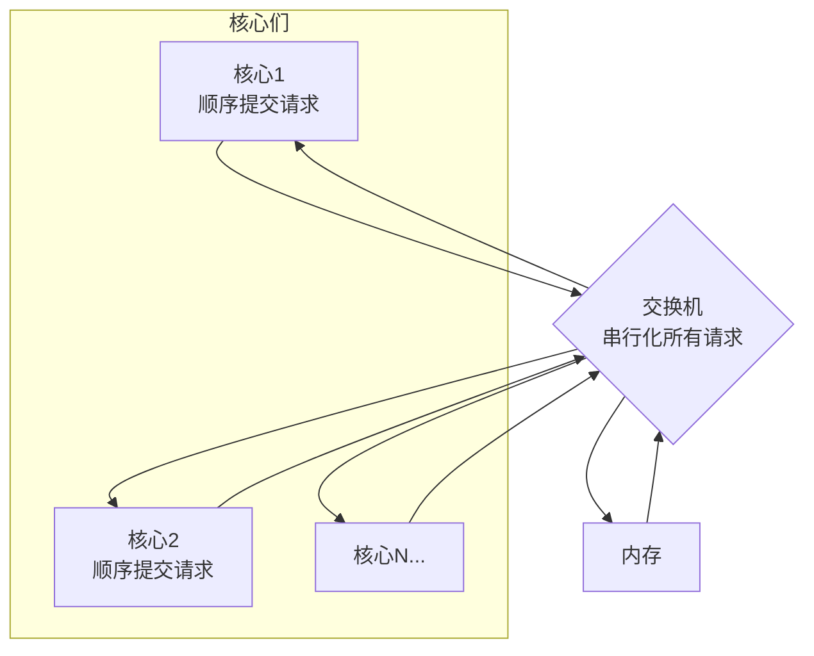
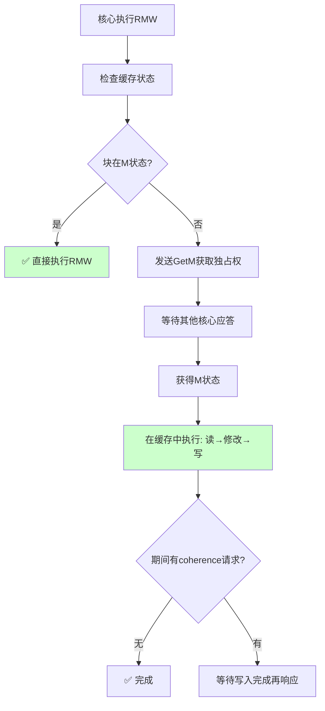
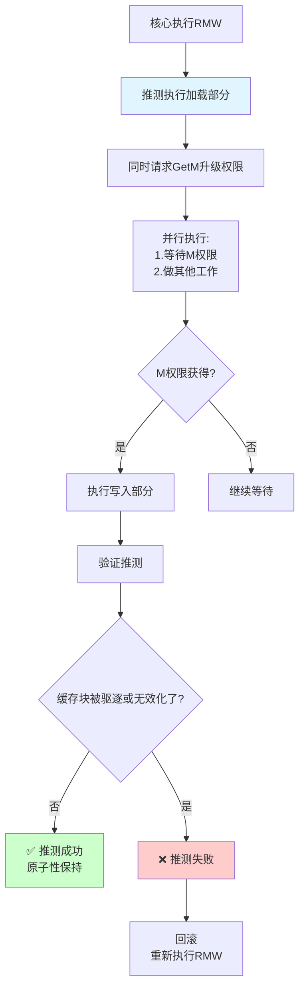

 #Memory-Consistency 
 
 本章深入研究了 Memory-Consistency 模型又名内存模型。
# 什么是Memory-Consistency Model(内存模型)

  内存模型为程序员和实现者定义了共享内存系统的行为，这些模型定义了正确性，以便程序员知道期望什么，实现者提供什么？

# Sequential-Consistency 的基本思想

SC 是最直观的内存模型，它最早由 Lamport 形式化，他将单个处理器核心称之为顺序执行，如果执行的结果按照程序指定的顺序执行操作相同，多处理器为顺序一致，前提是任何执行的结果与所有处理器（核心）的操作都以某种顺序执行的结果相同，并且每个单独的处理器（核心）的操作都以该顺序出现在其程序指定的顺序。这种操作的总顺序称为内存顺序。

SC 的两个条件
- 程序顺序保持
	- 单个处理器上的操作在最终全局顺序上不会被重新排序
- 内存一致性
	- 每个读必须返回全局顺序上中该地址上最新一次写的值


## 两种朴素SC实现的核心思想

### **1. 多任务单处理器实现**

**基本思想**：在**单个核心**上轮流执行所有线程


**关键机制**：

- **原子性执行块**：每个线程在其时间片内连续执行
- **完整内存操作**：切换前必须完成所有未完成的内存操作
- **单核顺序性**：单处理器天然尊重程序中的数据依赖
    

**为什么这满足SC**：
1. 全局顺序 = 实际执行的时间顺序
2. 每个线程的操作保持程序顺序（单核保证）
3. 读操作看到最近写操作的值（内存操作完成才切换）

**比喻**：像**单线程CPU上的操作系统时间片轮转**，每次切换都确保内存状态完全同步。

---

### **2. 交换机实现**

**基本思想**：所有核心通过**单一交换机**访问共享内存
**关键机制**：
- **核心本地顺序**：每个核心按程序顺序向交换机提交请求
- **交换机串行化**：交换机选择一个请求，等待内存完全处理，再选下一个
- **无饥饿保证**：交换机不能饿死任何核心的请求




## 高效SC实现的启示

这些朴素实现揭示了**高效SC实现的关键挑战**：
### **需要解决的问题**：
1. **如何并行化内存访问**？
2. **如何保持全局顺序的假象**？    
3. **如何避免交换机/内存的瓶颈**？
### **实际高效实现的技术**：

（这些是后面章节会讨论的）
- **目录式缓存一致性**：维护谁有什么副本
- **基于总线的监听协议**：广播写操作  
- **推测执行与验证**：乐观并行，事后检查
- **硬件事务内存**：批量操作，原子提交


## 基于 Cache Coherence 的基本 SC 实现
基于 Cache Coherence 的情况下， 保证多个处理器对同一个内存位置要么存在多个只读核心要么存在一个可以读写的核心。
### 优点
### **利用缓存优势**
- **降低延迟**：L1缓存命中 ~1-3周期 vs 内存 ~100+周期
- **提高带宽**：多个L1缓存同时服务请求
- **减少争用**：不同地址的操作完全并行
### 与协议同拓展
系统扩展性 = min(一致性协议扩展性, 互连网络扩展性)， 而不是受限于单个串行组件

## 缺点
1. 同一核心的顺序提交
	- 限制了指令级并行(ILP)
	- 后续优化：写缓冲区、推测执行
2. 冲突操作的串行化
	- 对同一地址的写操作必须串行，这是SC语义要求的，不是实现限制


## 使用缓存 Coherence 优化 SC 实现
### 非绑定预取
基于 Cache Coherence 的 SC 实现中获取数据需要确认内存块的权限，非绑定预取是提前获取权限，在加载数据时能快速获取数据

#### 两种常见预取目标
1. 为读操作预取
	- 目前状态: I(Invalid) -> 预取后: S(Shared)
	- 目的:  当执行LOAD时, 能直接从缓存读
2. 为读操作预取
	- 目前状态: I或S -> 预取后: M(Modified)
	- 目的: 当执行STORE时. 能直接写缓存

```C
for (int i = 0; i < N; i++) {
    // 传统：执行时才获取权限
    data[i] = compute();
    
    // 非绑定预取：提前获取未来元素的权限
    // 但不是提前加载数据！
}
```
#### 非绑定预取为什么不影响内存一致性模型
系统模型
        核心
          ↓
[缓存一致性内存系统] ← 非绑定预取只影响这里
          ↓
        内存
非绑定预取只影响缓存一致性内存系统

#### 非绑定预取对比绑定预取的优点
1. 寄存器太宝贵，不能浪费  
2. 内存带宽相对充足
3. 预取算法可以更激进
4. 多核环境下必须灵活

### 动态调度核心
动态调度核心为了实现比静态调度的核心更高的性能，许多现代核心会动态的按照程序顺序以外的顺序调度执行。使用动态调度的单核处理器只需要在程序内执行真实的数据调度指令执行。

但多核处理器上下文 ， 动态调度引入了一个新的问题，核心重排指令对其他的核心不可见，这将违反SC。
两种解决办法
1. 缓存块驻留检查
	- 通过检查块是否还在缓存中， 如果块还在缓存中，其他的核心无法写入
2. 加载重放验证
	- 在提交时重新执行推测加载比较值是否一致

### 多线程
SC 实现可以容纳多线程，每个多线程核心应该在逻辑上等同于多个虚拟核心，他们通过一个交换机共享每个一级缓存。因为两个虚拟核心在逻辑上是两个核心所以虚拟核心的通信依然需要依赖于缓存一致性


## SC 的原子操作
原子执行指令向程序员提供了同步线程的操作
在微架构中实现原子指令在概念上很简单，但幼稚的设计会导致原子指令的性能不佳。实现原子指令的正确但简单的方法是让核心有效地锁定内存系统（即阻止其他核心发出内存访问）并执行其对内存的读取、修改和写入操作。这种实现虽然正确且直观，但牺牲了性能。

更积极的方法， 获取处于状态M的块来实现，如果未处于该状态则在其缓存中加载和存储该块



更加优化的 RMW 实现可以在加载部分和存储部分执行之间留出更多时间，而不会违反原子性。考虑块在缓存中处于只读状态的情况。RMW 的加载部分可以推测性地立即执行，而缓存控制器发出 coherence 请求，将块的状态升级为读写。当块以读写状态获取后，RMW 的写入部分执行。只要核心能够保持原子性的假象，这种实现就是正确的。

